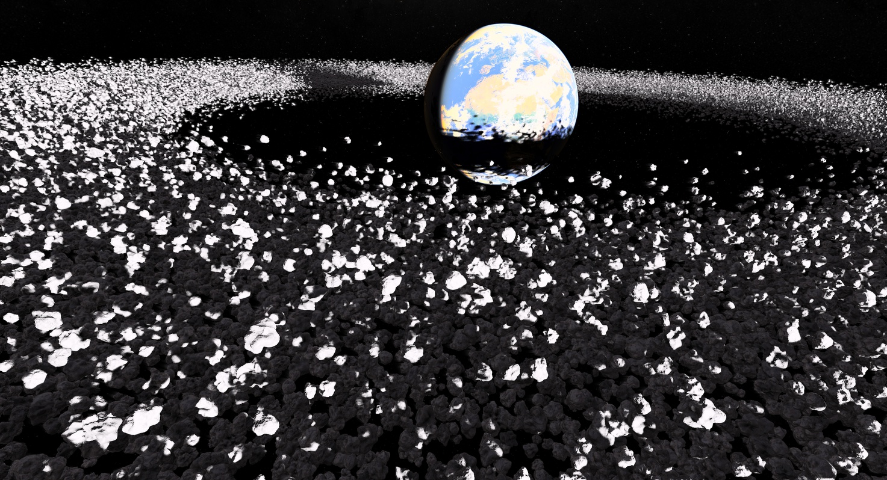
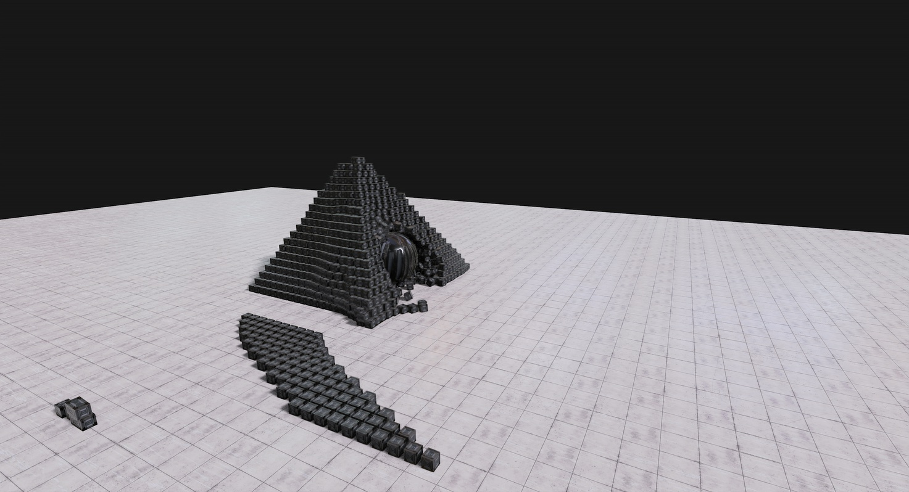
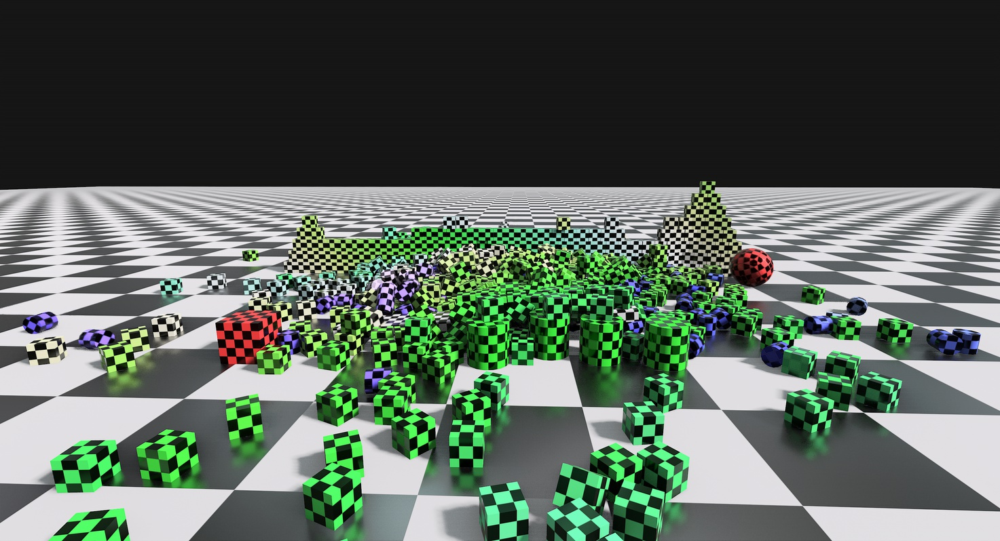

# Tellusim Engine SDK Demos

Gravity demo (based on GravityMark benchmark). Showcases Graph scripting for massive Node animation using a custom compute shader.

PhysX, Jolt, and Bullet physics plugins demo.

Python embedding example.
